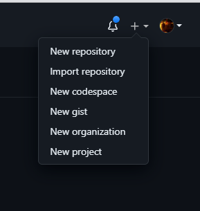
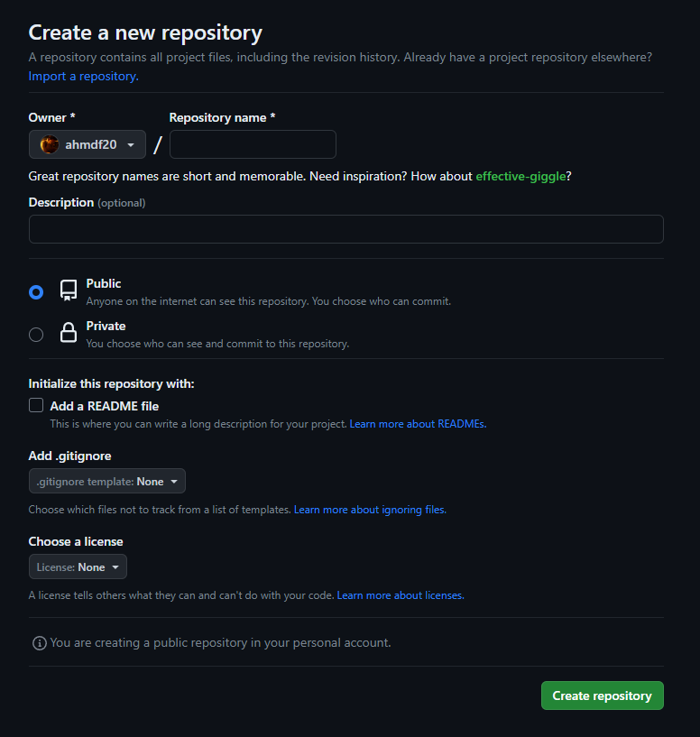
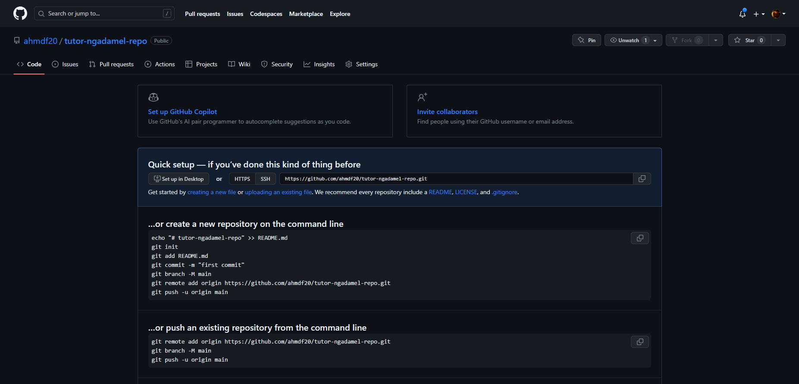

# gitbash

Kumaha carana nganggo gitbash? <br>
Sateuacan didinya nganggo gitbash, didarinya kedah nginstall <a href="https://git-scm.com/download/win">git scm</a> tipayun.
Nalika didarinya tos ngadownload aplikasi git scm, nginstallna te kedah mencet opsi nu sanes, tinggal klik pikeun rengse.

## kumaha cara nga-push?

Didarinya kedah ngadamel repositori ti akun github masing-masing, nalika didarinya teu acan gaduh akun github.... nya ngadamel hela atuh

### 1. Ngadamel repositori
<hr>
Ngadamel repositori gampil pisan, cik didarinya tingali kana ujung katuhu ti dashboard masing-masing, ke didarinya bakal ningal profil didarinya nu bentukna buleud <br>
Klik tanda tambah digigir profil, trus klik New Repository.
<center>

</center>

Terus, didarinya bakal dialihkeun ka halaman nu benten
<center>

</center>

nah kanggo nami projectna mah eta kumaha ka didarinya bade namianna kumaha.

### 2. Nge-push ka github
<hr>
Di step nu iyeu, didarinya dianggep tos ngadamel repositori nu enggal. Lamun didarinya atos ngadamel, tampilanna kawak kieu
<center>

</center>
Duh cape nganggo basa sunda nu lemes, wayahna wehnya campuran basana hehe

Mun ditingal dina gambar diluhur eta, didarinya pasti mendakan link kanggo repositorina. Mun nu abdi mah https://github.com/ahmdf20/tutor-ngadamel-repo.git <br>
Cik weh ku didarinya copas, lanjut kana gitbash.

Sateuacan ngepush, pastikeun path gitbash didarinya aya ti project nu bade di push. Misalna C:/xampp/htdocs/belajar-push-github <br>
Mun tos kitu, didarinya tinggal copas code iyeu

```command
git init

git add .
```

Terus
```command
git remote add origin https://github.com/ahmdf20/tutor-ngadamel-repo.git
```
saentos origin nyaeta link repositori didarinya

Lanjut
```command
git commit -m "pesan commit"

git push -u origin master
```
Beres...
Sok follow sareng komen mun didarinya masih aya error saentos nuturkeun tutor ti abdi 😅👌